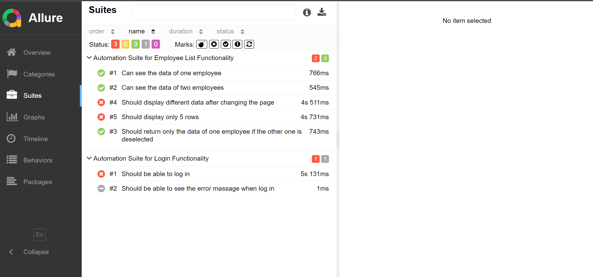

# Roche Technical assessment

This repository contains automated tests implemented with Cypress for Roche's technical assessment. These tests are designed to assess and validate the functionality of Roche's application according to the specified requirements.

## Requisites

Before proceeding, make sure Node.js is installed on your system. To check, open a terminal or command prompt and enter the following commands:
```sh
node -v
npm -v
```
If Node.js is installed, you will see version numbers for Node.js and npm. If not, you'll receive an error message or an indication that the command is not recognized. If the command is not recognized please refer to the [Node download page](https://nodejs.org/en/download).


## Installation

Clone this repository:
```sh
git clone <https://github.com/Edd1525/roche.git
```

While in the same directory as the project, use the following command to install all the necessary dependencies required to run the project:
```sh
npm install
```

## Commands aviable

There are several commands available:
```sh
npm run startServer 
```
Start the web server on your computer. It should be available at http://192.168.2.64:8080 or http://127.0.0.1:8080 this allows testing the page manually. It's NOT necessary for the next commands because they start the server themselves.

```sh
npm run chromeTest 
```
Start the web server and run the tests on Google Chrome in headless mode.

```sh
npm run chromeHeadTest 
```
Start the web server and run the tests on Google Chrome in headed mode.

```sh
npm run firefoxTest 
```
Start the web server and run the tests on Mozilla Firefox in headless mode.

```sh
npm run edgeTest 
```
Start the web server and run the tests on Microsoft Edge in headless mode.

## Reporting

After the tests finish running they will generate a folder called 'allure-results' which contains the result of the execution. To see this results we will need Allure, if we use the following command for the first time:
```sh
npx allure-commandline serve
```
Node will promopt us to install the tool allure-commandline which will allow use to generete an allure report everytime we use the command and we are in the same directory as the folder allure-results.

Example of the execution in Allure:



